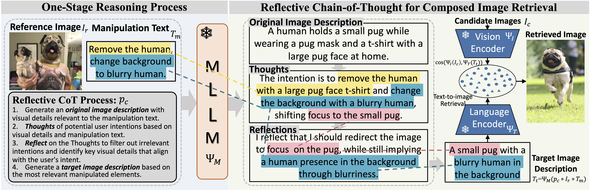
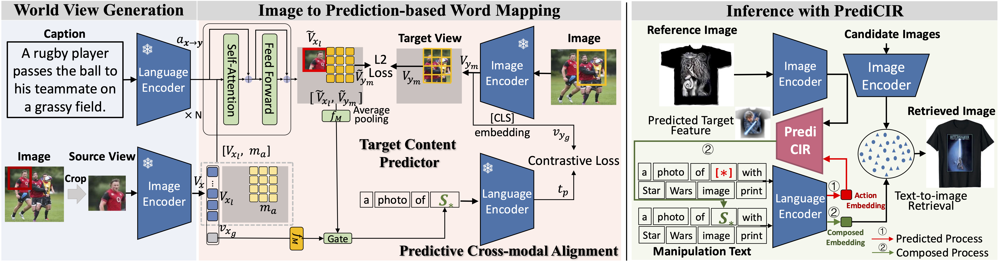
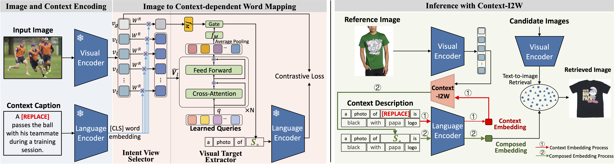
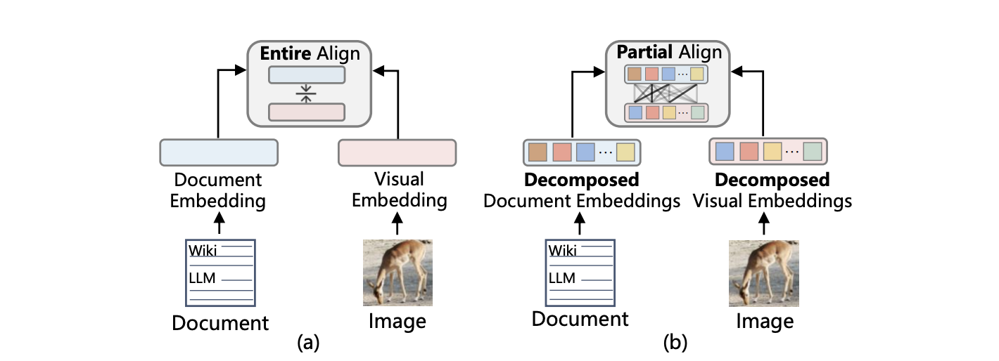

---

Hi, my name is Yuanmin Tang (Chinese: 唐源民), a Ph.D. Candidate (4th year student, 2021-2026) at the University of Chinese Academy of Sciences (UCAS), Beijing, China, advised by [Dr. Jing Yu](https://scholar.google.com.hk/citations?hl=zh-CN&user=P75F9-QAAAAJ). Currently, I am also an intern in the Data, Knowledge, Intelligence (DKI) team at Microsoft, previously part of Microsoft Research Asia, supervised by [Dr. Jue Zhang](https://www.microsoft.com/en-us/research/people/juezhang/). I also closely collaborate with [Prof. Qi Wu](https://www.adelaide.edu.au/directory/qi.wu) from the University of Adelaide.

**<ins>🔥🔜: I am actively seeking opportunities as a Research Intern or Research Assistant, aiming toward future roles such as Postdoctoral Researcher upon graduation!</ins>**

## 📖 Research

My primary research interests are centered around advanced multimodal learning and explainable artificial intelligence, specifically focusing on:

* **<ins>⭐ Zero-Shot Composed Image Retrieval</ins>**
* Multimodal Large Language Models
* Cross-modal Sponsored Search
* Explainable Machine Learning
* Watermarking Techniques in Vision-Language Models

**PS: If you're interested in collaboration or just want to chat, feel free to reach out via e-mail at [tangyuanmin@iie.ac.cn](mailto:tangyuanmin@iie.ac.cn), or via wechat at Peter20200618.**

## 🎉 News

* 2025.06: 🉠Two paper accepted at **CVPR'25**, including one <strong>Highlight</strong> presentation!
* 2024.12: 🎉 Awarded Top Reviewer at **NeurIPS 2024**!
* 2024.10: 🎉 Started internship at Microsoft DKI (supervisor Dr. Jue Zhang). 
* 2024.08: 🉠<strong>Oral</strong> presentation at **AAAI'24**.
* 2021.09: 🎉 Started Ph.D. studies at UCAS.
* 2021.10: 🎉 Co-author journal paper published in **IEEE TWC (IF: 9.6)**.
* 2020.09: 🎉 Co-author journal paper published in **Sustainable Cities and Society (IF: 11.0)**.

## 📝 Selected Publications

<dl>
<dt></dt>
<dd><a href="https://openaccess.thecvf.com/content/CVPR2025/html/Tang_Reason-before-Retrieve_One-Stage_Reflective_Chain-of-Thoughts_for_Training-Free_Zero-Shot_Composed_Image_Retrieval_CVPR_2025_paper.html"><strong>Reason-before-Retrieve: One-Stage Reflective Chain-of-Thoughts for Training-Free Zero-Shot Composed Image Retrieval</strong></a></dd>
<dd><strong>Yuanmin Tang</strong>, Jue Zhang, Xiaoting Qin, Jing Yu, Gaopeng Gou, Gang Xiong, Qingwei Lin, Saravan Rajmohan, Dongmei Zhang, Qi Wu</dd>
<dd>Conference on Computer Vision and Pattern Recognition (CVPR'25), <mark>Highlight</mark>, 2025, CCF-A</dd>
</dl>
   

---

<dl>
<dt></dt>
<dd><a href="https://openaccess.thecvf.com/content/CVPR2025/html/Tang_Missing_Target-Relevant_Information_Prediction_with_World_Model_for_Accurate_Zero-Shot_CVPR_2025_paper.html"><strong>Missing Target-Relevant Information Prediction with World Model for Accurate Zero-Shot Composed Image Retrieval</strong></a></dd>
<dd><strong>Yuanmin Tang</strong>, Jing Yu, Keke Gai, Jiamin Zhuang, Gang Xiong, Gaopeng Gou, Qi Wu</dd>
<dd>Conference on Computer Vision and Pattern Recognition (CVPR'25), 2025, CCF-A</dd>
</dl>
 

---

<dl>
<dt></dt>
<dd><a href="https://ojs.aaai.org/index.php/AAAI/article/view/28281"><strong>Context-I2W: Mapping Images to Context-dependent Words for Accurate Zero-Shot Composed Image Retrieval</strong></a></dd>
<dd><strong>Yuanmin Tang</strong>, Jing Yu, Keke Gai, Jiamin Zhuang, Gang Xiong, Yue Hu, Qi Wu</dd>
<dd>The Thirty-Eighth AAAI Conference on Artificial Intelligence (AAAI'24), <mark>Oral</mark>, 2024, CCF-A</dd>
</dl>
 

---

<dl>
<dt></dt>
<dd><a href="https://dl.acm.org/doi/abs/10.1145/3664647.3680829"><strong>Visual-Semantic Decomposition and Partial Alignment for Document-based Zero-Shot Learning</strong></a></dd>
<dd>Xiangyan Qu, Jing Yu, Keke Gai, Jiamin Zhuang, <strong>Yuanmin Tang</strong>, Gang Xiong, Gaopeng Gou, Qi Wu</dd>
<dd>ACM International Conference on Multimedia (ACM MM), 2024, CCF-A</dd>
</dl>
 

## 🌟 Academic Service

### Conference Committee Member

* TPC Member / Reviewer for **CVPR'25**, **ICCV'25**, **ICML'25**, **ICME'25**, **ACM MM'25**, **NeurIPS'25**
* TPC Member / Reviewer for **ICLR'24**, **NeurIPS'24** (Top Reviewer Award)
* TPC Member / Reviewer for **ICME'23**

### Journal Reviewer

* Reviewer for **IEEE Transactions on Circuits and Systems for Video Technology (TCSVT)**
* Reviewer for **Transactions on Machine Learning Research (TMLR)**

Always excited about new ideas and discussions!